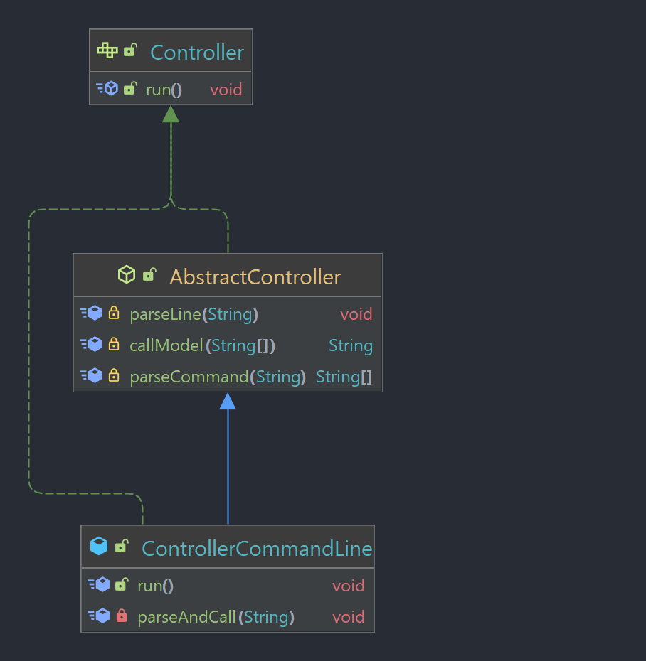

# Assignment 4

## Group Members

- Tanmay Gadgil
- Seung Hun Lee
- Javad MoeinNajafabadi

## Class and Interface Definitions

### Model:

The model implements the actual functionalities offered by the program.
In model module we have the following classes:

- **Model:** This interface represents possible actions to be done on a PPM file. This interface
  has the following methods:

    - load
    - save
    - greyscale
    - flip
    - brighten
    - rgbSplit
    - rgbCombine


- **MockModel:** This interface is a Mock of Model interface for testing the controller easier.
  This interface has the following methods:

    - getLog


- **ModelPPM:** The ModelPPM class represents a PPM image file and provides functionality for
  loading,
  saving, and modifying the image. This class implements Model interface.
  The image is stored as a HashMap where the key is a
  String representing the image name and the value is a three-dimensional array of integers
  representing the red, green and blue pixels.


- **ModelPPMMock:** This a Mock class of ModelPPM class for testing the controller easier, which
  implements MockModel.


- **Axes:** This enumerated type represents which axe should be considered for flip method.


- **ImageComponents:**  This enumerated type represents which component should be considered
  for the greyscale method.


- **ImageUtil:** This class contains utility methods to read a PPM image from file and simply
  print its contents.

### View:

The view is the part of the program that shows results to the user.

- **Controller:**
- **AbstractController:**
- **ControllerCommandLine:**
- **ControllerScriptFile:**

### Controller:




The controller takes inputs from the user and tells the model what to do and the view what to show.

- **View:**
- **ViewScriptFile:**
- **MockScriptFile:**
- **TextInputView:**
- **CommandLineView:**

## Commands

### Accepted commands

Here is a list of accepted commands for both the command mode and the script mode.

1. load <image-path> <image-name>
2. save <image-path> <image-name>
3. greyscale <component-name> <image-name> <dest-image-name>
4. horizontal-flip <image-name> <dest-image-name>
5. vertical-flip <image-name> <dest-image-name>
6. brighten <increment_value> <image-name> <dest-image-name>
7. rgb-split <image-name> <dest-image-name-red> <dest-image-name-green> <dest-image-name-blue>
8. rgb-combine <image-name> <red-image> <green-image> <blue-image>


The main script of this application is run using the Main.java class found in the src/ folder

The first step is to compile the classes to ensure that they run in the terminal
To compile the code

#### Before running the script:

1. First be in the [src/](./src/) directory
    ```shell
   cd src/
   ```
2. Run the compilation script
    ```shell
    sh compile_all.sh
    ```

#### Running the Script:

**Command line mode**

In this mode the app runs when the user gives command line inputs into the terminal
To run the script:

```shell
cd src/
```

```shell
java Main.java
```

To exit the application enter the command ```exit``` or use ```ctrl-c```

**Scripting mode**

This mode accepts a script to run. This script is a text file which lists out all the
commands that can be given in the terminal. To add a comment add in text following a ```#```
character

To run the application script mode attach the -s flag to the command line arguments

```shell
cd src/
```

```shell
java Main.java -s <location of script file.txt>
```

### Sample Scripts

Run these sample scripts for the following use cases

#### Running in command mode

First execute
```shell
>>> cd src/
>>> java Main.java
```

Then execute the following commands **one at a time**

```shell
>>> load sample.ppm scene

>>> vertical-flip scene scene-vertical

>>> rgb-split scene scene-red scene-green scene-blue

>>> save scene-red.ppm scene-red

>>> save scene-green.ppm scene-green

>>> save scene-blue.ppm scene-blue
```

#### Running in script mode

```shell
>>> cd src/
>>> java Main.java -s testScript.txt
```

