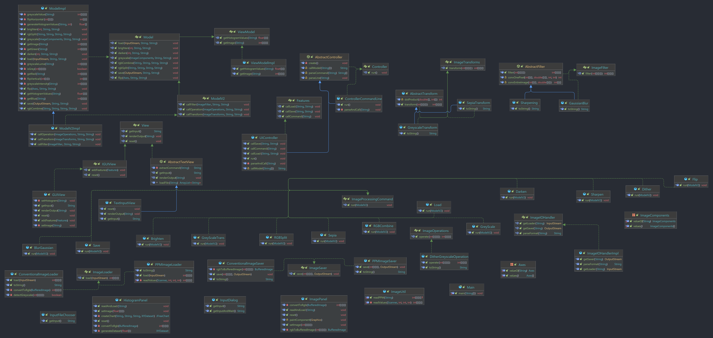
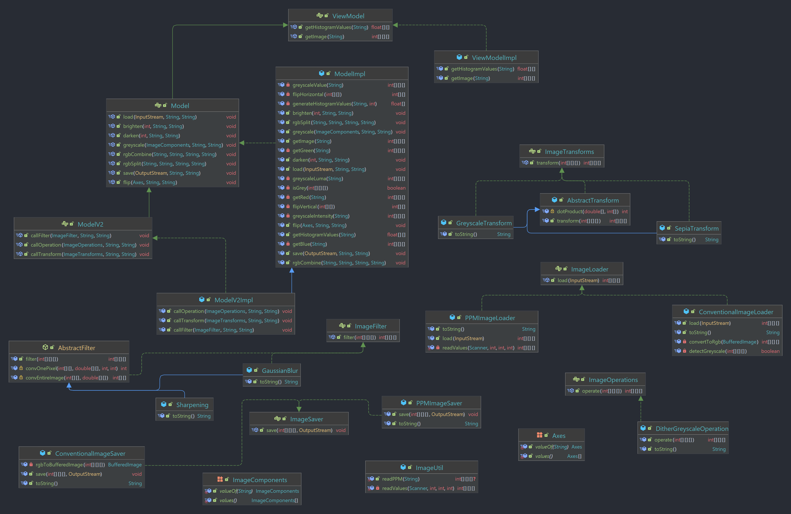
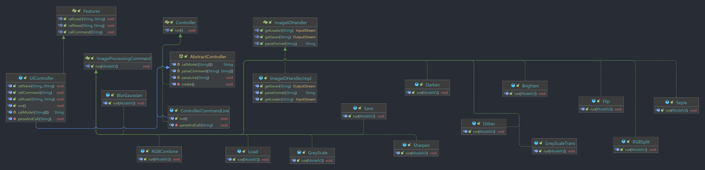
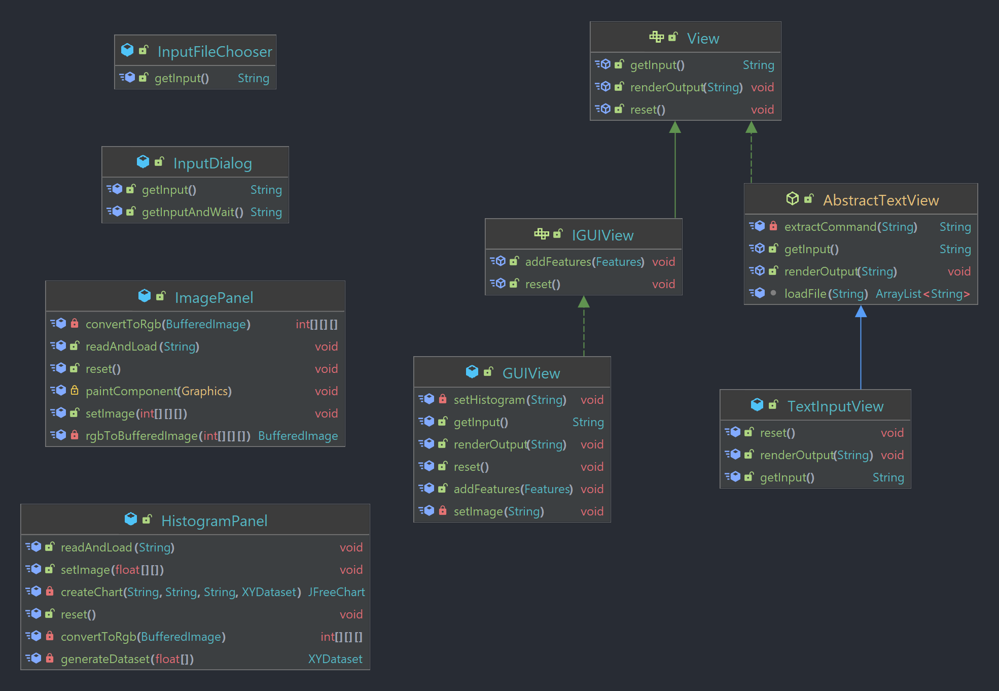
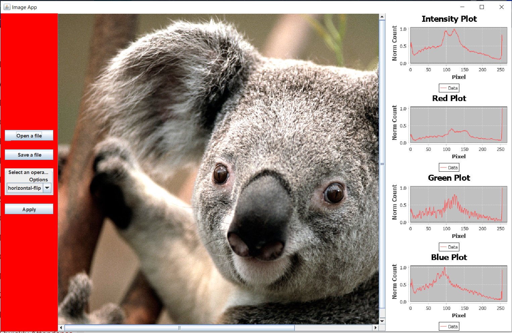

# Assignment 6

## Group Members

- Tanmay Gadgil
- Seung Hun Lee
- Javad MoeinNajafabadi

## Overview

This builds on top of the previous assignment and is an image processing application that has three
modes of operation.

1. A Graphical user Interface that uses buttons and components to perform operations on images.
2. A script mode, that accepts a script text file with a list of commands
3. A text mode that allows users to interact with the model via a terminal text environment.
   The design is written as an MVC application.
   Details of each component are described below. This version of the application can only handle
   PPM
   images but can be extended for other formats in the future.

At a high level this is how the application functions:

## Class and Interface Definitions

### Model

The model implements the actual functionalities offered by the program.
In model module we have the following classes:

- **Model:** This interface represents possible actions to be done on an image file. This interface
  has the following methods:

    - load
    - save
    - greyscale
    - flip
    - brighten
    - rgbSplit
    - rgbCombine

- **ModelV2:** This interface extends the Model interface above and adds the ability to call
  filters, color transformations and dithering to an image.
    - callFilter
    - callTransform
    - callOperation

- **loaders** This directory holds the different kinds of loaders needed for different types of
  images.

- **savers** This directory holds the different kinds of savers needed for different types of
  images.

- **filters** This directory contains all of the possible filters to which can be applied to an
  image.

- **operations** This directory contains all of the possible operations to which can be applied to
  an image.

- **transforms** This directory contains all of the possible transforms to which can be applied to
  an image.

- **MockModel:** This interface is a Mock of Model interface for testing the controller easier.
  This interface has the following methods:

    - getLog

- **ModelImpl:** The ModelImpl class represents the image files and provides functionality for
  modifying the image. This class implements Model interface.
  The image is stored as a HashMap where the key is a
  String representing the image name and the value is a three-dimensional array of integers
  representing the red, green and blue pixels.

- **ModelV2Impl** The ModelV2Impl class extends the ModelImpl class and implements the ModelV2
  interface. This class provides all of the functionality of the ModelImpl, but adds the ability
  to call features, color transformations and dithering.

- **Axes:** This enumerated type represents which axe should be considered for flip method.

- **ImageComponents:**  This enumerated type represents which component should be considered
  for the greyscale method.

- **ImageUtil:** This class contains utility methods to read a PPM image from file and simply
  print its contents.

- **ViewModel:** This class offers a way for the View to extract or read images from the model
  without the ability to actually edit the model state. This also gives the functionality to load in
  the histogram values of an image.

- **ViewModelImpl:** An implementation of the ViewModel.

### Controller

The controller takes inputs from the user and tells the model what to do and the view what to show.

- **Controller:** The given code represents an interface called "Controller" in the "controller"
  package of a Java application. The purpose of this interface is to provide a common contract for
  any class that wants to act as a controller in the Model-View-Controller (MVC) architecture.
  The interface has one method called "run()" which takes no arguments and returns void. This method
  is used to execute inputs from the view in a loop.

- **AbstractController:** This class is an abstract controller that implements the Controller
  interface. It provides a set of methods that all controllers need, such as parsing commands,
  calling the model, and rendering the output to the view.

- **ControllerCommandLine:** This class represents the command line implementation of the controller
  interface. It allows users to run commands through a model using a command line interface, and has
  a function called "parseAndCall" which parses input files and calls model functions.

- **ImageIOHandler:** An IO handler that parses image files and sends the respective input an output
  readers

- **commands:** A directory which contains all the commands our application supports.

- **Features:** Offers a features interface that indicate what current operations are supported
  by the current controller and model.

- **UIController:** Implements the features interface and extends the abstract controller. Uses
  inputs from the GUI and interfaces with the model.

### View

The view is the part of the program that shows results to the user.

- **View:** This is an interface for a view in a software system, which defines the two methods:
  getInput() to get input in a specific format and renderOutput() to output a string depending on
  the implementation.

- **MockScriptView:**  This is a Java class named "MockScriptView" that implements the "View"
  interface. It is a mock model of the view that is used for testing. It can read from a file and
  simulate user input, depending on the specified mode.

- **TextInputView:** The TextInputView class is a subclass of AbstractTextView and provides a
  command-line interface for user input. It has two modes, "command" and "script", with the former
  taking input directly from the user and the latter executing commands from a file in sequence
  until the end of the file or the command "exit" is reached.

- **IGUIView:** An interface for the basic functionality of a GUI based image processing
  application.

- **GUIView:** A GUI implementation of the IGUIView interface. Works with the UIController. This
  offers a basic UI with three components
    - A control panel - Where the user can load and save images and perform various operations on
      them.
    - An Image View - This is a scrollable image viewer where the image being worked on is displayed
    - A Histogram View - This displays the normalized histogram values of the image being viewed.
      These histograms represent the intensity, red, green and blue values of the image

- **ImagePanel:**  A class inheriting from JPanel that defines the behaviours of the image viewer

- **InputDialog:** A GUI dialog box used to pass inputs to the controller in the case that
  additional parameters are needed.

- **InputFileChooser:** A UI element used to choose a file from the local file system

- **HistogramPanel:** A class inheriting from JPanel that defines the behaviours of the histogram
  panel.

### A Screenshot of the GUI:

## Design Changes

### Assignment 5

- A change in the model interface for the load and save methods. This is to conform to the idea of
  exposing the file only to the controller and not the model.
- Change of the controller to incorporate the command design pattern. Commands are now modularized
  and any new command just needs ot be added to the command module extending the
  ImageProcessingCommand interface and adding to the commands hashmap.
- Adding a new interface ModelV2 which adds the functionality to call Filters, Operataions and
  Transformations.
- These operations conform to the command design pattern for maximum extensibility. To add a new
  filter a new implementation of the ImageFilter implementation must be done. This process is the
  same for transformations and operations.
- Added savers and loaders to load in PPM and Conventional file formats.

### Assignment 6

- Added a IGUIView interface and GUIView for the GUI
- Added a UIController to work with the gui and abstract controller
- Added a ViewModel Interface and implementation to allow the GUI to read images and histogram
  values from the model without the ability to perform operations on the model

#### Photo Citation

Photo provided by Etienne Steenkamp on unsplash https://unsplash.com/photos/oymHjI4qPJI.
License : https://unsplash.com/license

