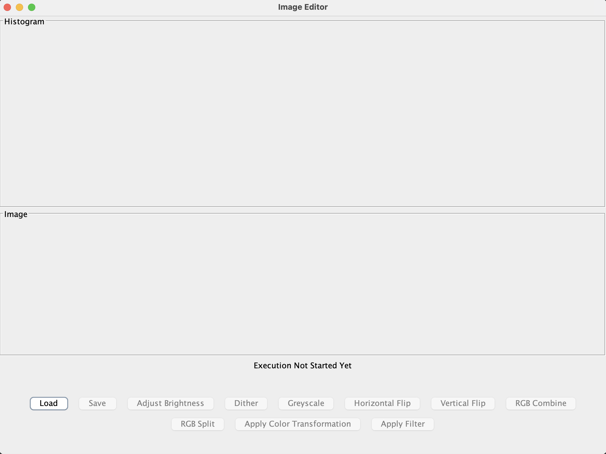
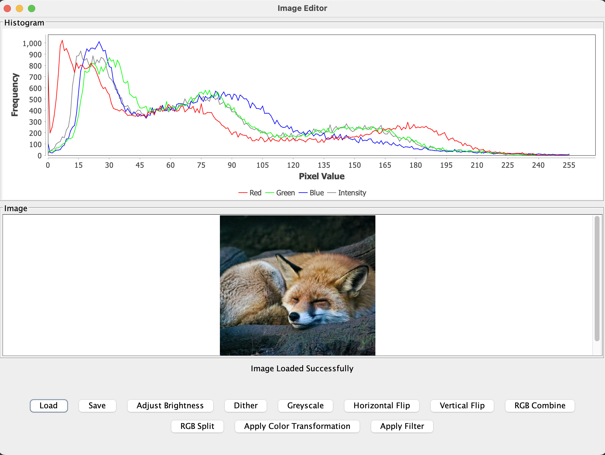

# GUI Support

Double-clicking the jar file or running it from a terminal without any command line arguments will load the GUI.

Screenshot:



Click the `Load` button to open a browse window and load an image. The selected image will be displayed in the GUI window along with a histogram of RGB and Intensity values.



There are buttons available for performing each operation. Some will directly operate on the image (horizontal flip, dither, etc.) whereas some operations will ask for additional user input (adjust brightness, color transform selection, filter selection, etc.)

If the image size is larger than the window, the image will be scrollable.

A status message is present below the image which states the last status of an operation. 
If an operation succeeds, fails or is cancelled by the user, an appropriate message will be displayed here.

Any operations can only be performed once an image has been loaded. The buttons for all other operations will be greyed-out if there is no loaded image.

## How to perform each operation in the GUI

- ### Load
  - Click the `Load` button. A browse window will open.
  - You can select the file type that is to be loaded at the bottom (png, ppm, bmp, jpg).
  - Browse to the file that you wish to open, select it and click `Open`.
  - The image and its histogram will now be visible in the GUI, assuming the file was loaded successfully.
- ### Save
  - Click the `Save` button. A browse window will open.
  - You can select the file type that is to be saved at the bottom (png, ppm, bmp, jpg).
  - Browse to the folder where you wish to save the image. Type the image name at the top and click `Save`.
- ### Adjust Brightness
  - Click the `Adjust Brightness` button. A popup window asking for the brightness value will open.
  - You can enter a positive or negative integer value here. A positive value will make the image brighter, and a negative value will make it darker.
  - Any non-integer input will cause a warning popup to be displayed and the operation will be cancelled.
  - Once the number is entered, click `OK`. The brightened or darkened image and the updated histogram will be visible.
- ### Dither
  - Simply click the `Dither` button and the dithered image and updated histogram will be displayed.
- ### Greyscale
  - Click the `Greyscale` button. A popup window with a dropdown asking for the component will open.
  - Select the component to perform greyscale on from the dropdown and click `OK`.
  - The updated image and histogram will be displayed.
- ### Horizontal Flip
  - Simply click the `Horizontal Flip` button and the horizontally flipped image will be displayed.
- ### Vertical Flip
    - Simply click the `Vertical Flip` button and the vertically flipped image will be displayed.
- ### RGB Combine
  - Click the `RGB Combine` button.
  - Three browse windows will open one after the other. The user needs to select three input images for combining.
  - Once the three images are selected, the combined image and the histogram will be displayed.
  - All three images must have the same dimensions. If they do not, a warning message will be shown under the image and the operation will be cancelled.
  - If any of the load operations are cancelled, the RGB Combine operation will be cancelled.
- ### RGB Split
  - Click the `RGB Split` button. A popup window asking for the component to be displayed will open.
  - Select the component from the dropdown which you want to see on the GUI and click `OK`.
  - After this, three browse windows will open one after the other. Each of the split images need to be saved here.
  - With this option, the user can load these split images at a later point in time to use them.
  - If any of the save operations are cancelled, the RGB Split operation will be cancelled.
  - Once the three images are saved, the selected component image and the histogram will be displayed.
- ### Apply Color Transformation
  - Click the `Apply Color Transformation` button. A popup window with a dropdown asking for the color transformation technique will open.
  - Select the color transformation technique from the dropdown and click `OK`.
  - The updated image and histogram will be displayed.
- ### Apply Filter
    - Click the `Apply Filter` button. A popup window with a dropdown asking for the filter to be applied will open.
    - Select the filter from the dropdown and click `OK`.
    - The updated image and histogram will be displayed.


# Script commands supported by the application

At least one image must be loaded at the start of the program.
Trying to run any other commands before the first load will raise an error message.

The image name specified in the commands below must exist in the current session
(i.e. it must have been loaded or operated on in some previous command).

The same image can be overwritten if the destination image name is the same as the input image name.

The commands will only accept the number of parameters specified in the examples below.
If an additional parameter is given, it will be assumed to be a new command and will raise an error
if it is not a valid command.

## Brighten

Syntax: `brighten <brightness delta value> <image name> <destination image name>`

Example: `brighten 50 fox fox-brightened`

The brightness delta value must be an integer.

## Blur

Syntax: `blur <image name> <destination image name>`

Example: `blur mountains mountainsblur`

## Dither

Syntax: `dither <image name> <destination image name>`

Example: `dither fox fox`

## Greyscale

Syntax: `greyscale <component> <image name> <destination image name>`

Example: `greyscale value-component fox fox-grey-val`

OR

Syntax: `greyscale <image name> <destination image name>`

Example: `greyscale fox fox-grey`

If a component is specified, it should be valid.
Valid components are: red, green, blue, value, intensity, luma

If no component is specified as in the second example above, 
the component will be set to 'luma' internally.
If you want to call the color transformation greyscale, you will need to use the second example.

## Horizontal Flip

Syntax: `horizontal-flip <image name> <destination image name>`

Example: `horizontal-flip fox fox-hflipped`

## Load

Syntax: `load <image path> <image name>`

Example: `load res/fox.png fox`

The file path should not contain spaces.

## RGB Combine

How to
use: `rgb-combine <combined image name> <red image name> <green image name> <blue image name>`

Example: `rgb-combine mtn-combined mtn-red mtn-green mtn-blue`

## RGB Split

Syntax: `rgb-split <image name> <red image name> <green image name> <blue image name>`

Example: `rgb-split mtn mtn-red mtn-green mtn-blue`

## Save

Syntax: `save <image path> <image name>`

Example: `save res/foxSaved.bmp fox`

The file path should not contain spaces.

## Sepia

Syntax: `sepia <image name> <destination image name>`

Example: `sepia mtn mtn-sepia`

## Sharpen

Syntax: `sharpen <image name> <destination image name>`

Example: `sharpen mtn mtn-sharp`

## Vertical Flip

Syntax: `vertical-flip <image name> <destination image name>`

Example: `vertical-flip fox fox-vFlip`


# Run the program with command line arguments with a JAR file

### The `-text` argument

Syntax: `java -jar <jar file path> -text`

Example:
```
java -jar ImageEditor.jar -text
```

This will run the program in an interactive scripting mode where the user can type in commands one at a time on the command line.

### The `-file` argument

Syntax: `java -jar <jar file path> -file <script file path>`

Example: 
```
cd res/
java -jar ImageEditor.jar -file script.txt
```

The terminal must be in the `res/` folder for the commands in the `script.txt` to work correctly,
as all the paths are relative to the `res/` folder. All the output images from the script file
will be stored in a `scriptOutput` folder inside the `res/` folder.

If the above example is run when the terminal is not in the `res/` folder then the images will 
not be loaded and saved correctly due to the relative file path being incorrect.